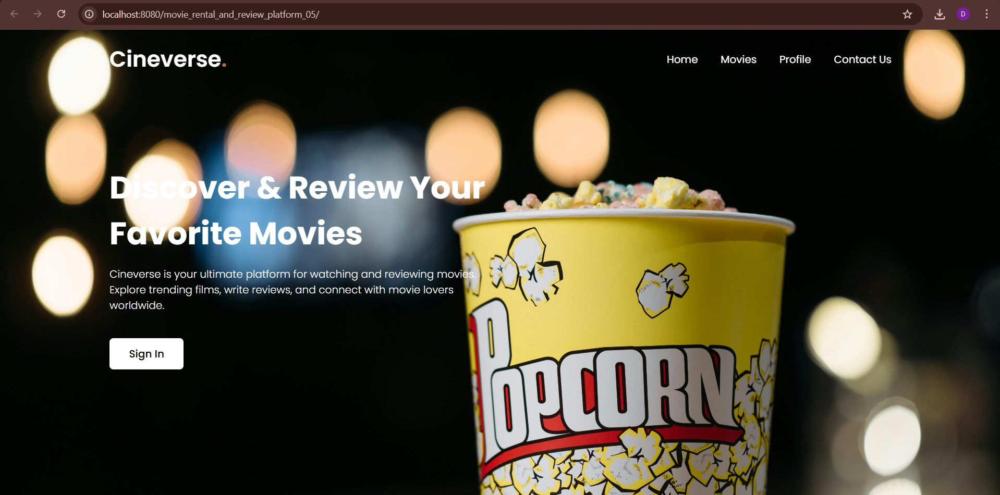
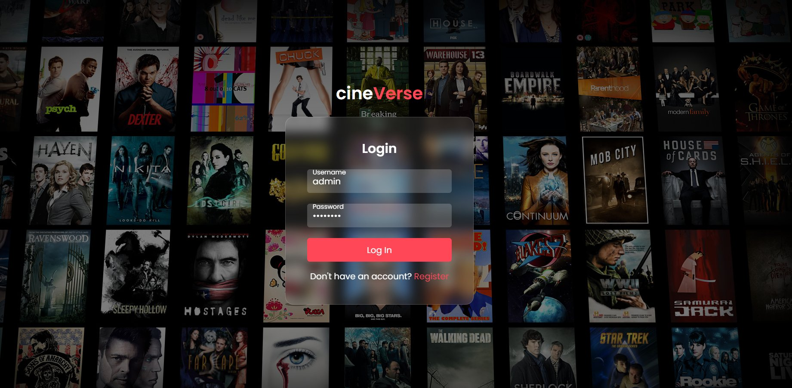
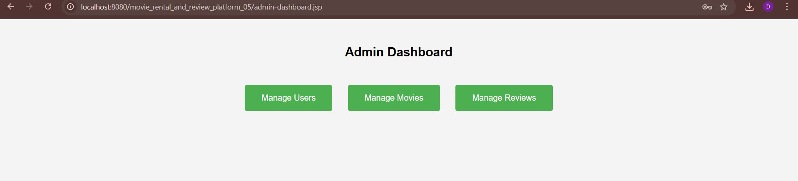
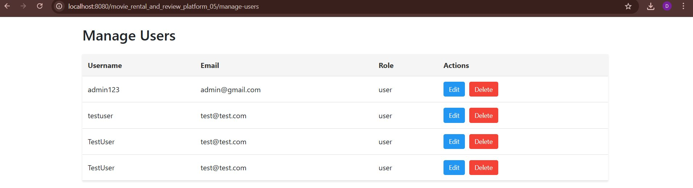

# 🎬 Cineverse — Movie Rental and Review Platform

A full-stack web application built with **Java Servlets**, **JSP**, and **file-based storage** that allows users to browse, rent, and review movies — with a dedicated admin panel for complete platform management.

---

## 📸 Screenshots

### Home Page


### Login Page


### Admin Dashboard


### Manage Users


---

## 🛠️ Tech Stack

| Layer | Technology |
|-------|-----------|
| Backend | Java Servlets |
| Frontend | JSP, HTML, CSS |
| Build Tool | Apache Maven |
| Data Storage | File Handling (TXT/CSV) |
| DSA | Custom BubbleSort, Stack |
| Server | Apache Tomcat 11 |
| IDE | IntelliJ IDEA |

---

## 📁 Project Structure

```
src/
├── main/
│   ├── java/
│   │   ├── controller/       ← Servlet controllers (request handling)
│   │   │   ├── UserLoginServlet.java
│   │   │   ├── UserRegisterServlet.java
│   │   │   ├── MovieListServlet.java
│   │   │   ├── MovieDetailsServlet.java
│   │   │   ├── RentMovieServlet.java
│   │   │   ├── PaymentServlet.java
│   │   │   ├── ReviewServlet.java
│   │   │   ├── AdminServlet.java
│   │   │   └── ... (more controllers)
│   │   ├── models/           ← Data models
│   │   │   ├── Movie.java
│   │   │   ├── User.java
│   │   │   ├── Rental.java
│   │   │   ├── Review.java
│   │   │   └── Payment.java
│   │   ├── services/         ← DAO layer (file I/O)
│   │   │   ├── MovieDao.java
│   │   │   ├── UserDao.java
│   │   │   ├── RentalDao.java
│   │   │   ├── ReviewDao.java
│   │   │   ├── PaymentDao.java
│   │   │   └── AdminDao.java
│   │   └── dsa/              ← Custom data structure implementations
│   │       ├── BubbleSort.java
│   │       └── Stack.java
│   └── webapp/               ← JSP views + assets
│       ├── home.jsp
│       ├── login.jsp
│       ├── register.jsp
│       ├── movie-list.jsp
│       ├── movie-details.jsp
│       ├── rental-form.jsp
│       ├── payment.jsp
│       ├── rental-history.jsp
│       ├── review-form.jsp
│       ├── profile.jsp
│       ├── admin-dashboard.jsp
│       ├── manage-movies.jsp
│       ├── manage-users.jsp
│       ├── manage-reviews.jsp
│       └── assets/           ← CSS stylesheets & images
└── data/                     ← File-based data storage
    ├── movies.txt
    ├── users.txt
    ├── admins.txt
    ├── rentals.txt
    ├── reviews.txt
    └── payments.txt
```

---

## ✨ Features

### 👤 User Features
- Register and log in with role-based authentication
- Browse all available movies with images, genre, and pricing
- Search movies by title or genre
- Sort movies by rating using custom BubbleSort algorithm
- View full movie details and customer reviews
- Rent a movie and proceed to payment
- View personal rental history (LIFO order using custom Stack)
- Submit and manage movie reviews
- Edit account details or delete account

### 🔐 Admin Features
- Admin dashboard with quick access to all management tools
- Add, edit, and delete movies (with image upload)
- Manage all registered users — view, edit, delete
- Manage and moderate all reviews
- View all rental and payment records

---

## 🧠 Data Structures Used

| Structure | Class | Usage |
|-----------|-------|-------|
| Bubble Sort | `dsa/BubbleSort.java` | Sort movies by rental price |
| Stack | `dsa/Stack.java` | Rental history in LIFO order (most recent first) |

Custom implementations using Java Generics and Comparator — not Java's built-in sort.

---

## 💾 Data Storage

Flat file storage instead of a database. Each entity stored as CSV in `/data`:

| File | Stores |
|------|--------|
| `movies.txt` | movieId, title, genre, description, image, price |
| `users.txt` | userId, name, username, email, password, role |
| `admins.txt` | Admin credentials |
| `rentals.txt` | Rental records |
| `reviews.txt` | User reviews per movie |
| `payments.txt` | Payment transaction records |

---

## 🚀 How to Run

### Prerequisites
- Java JDK 17 or above
- Apache Maven
- Apache Tomcat 11
- IntelliJ IDEA with Smart Tomcat plugin

### Steps

**1. Clone the repository**
```bash
git clone https://github.com/JATHURSHAN-R/Movie-Rental-Platform.git
cd Movie-Rental-Platform
```

**2. Create data directory**

Create the folder `movie-rental-data` in your home directory and copy the data files:
- Windows: `C:\Users\<YourUsername>\movie-rental-data\`
- Mac/Linux: `~/movie-rental-data/`

**3. Open in IntelliJ IDEA**

File → Open → select the project folder. IntelliJ will detect Maven automatically.

**4. Configure Smart Tomcat**

Run → Edit Configurations → + → Smart Tomcat:
- Tomcat server: point to your Tomcat installation
- Deployment directory: `src/main/webapp`
- Context path: `/movie_rental_and_review_platform_05`
- Port: `8080`

**5. Run and access**
```
http://localhost:8080/movie_rental_and_review_platform_05/
```

### Default Admin Login
```
Username: admin
Password: Admin123
```

---

## 🏗️ Architecture

Follows **MVC (Model-View-Controller)** pattern:

- **Model** — Java classes in `/models` represent data entities
- **View** — JSP pages in `/webapp` handle the UI
- **Controller** — Servlets in `/controller` handle HTTP requests and business logic
- **DAO Layer** — Service classes in `/services` handle all file read/write operations

---

## 📌 Key Technical Highlights

- Role-based access control (User vs Admin) using session management
- Custom generic BubbleSort using Java Generics and Comparator interface
- Custom Stack implementation for LIFO-based rental history
- File I/O persistence with no database dependency
- Image upload functionality for movie posters
- Full CRUD operations for movies, users, and reviews
- Clean MVC separation with dedicated DAO service layer
- Password validation (minimum 6 chars, must include uppercase and number)

---

## 👨‍💻 Developer

**Jathurshan R** — IT24102094
BSc (Hons) Information Technology, Specialization in Cybersecurity
Sri Lanka Institute of Information Technology (SLIIT)

[](https://linkedin.com/in/Jathurshan)
[](https://github.com/JATHURSHAN-R)
